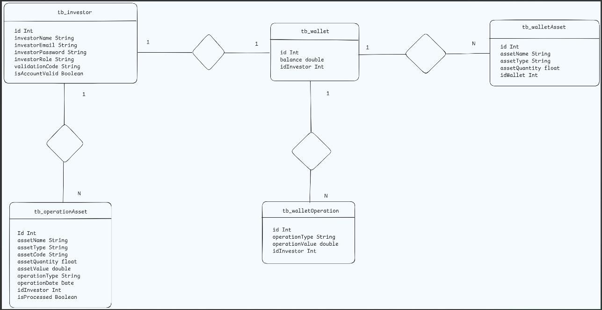

# Contexto da aplicação
## Esta api feita em go faz parte de um projeto de nome jumpStart, cujo objetivo é realizar simulações de compra e venda de ativos financeiros, possibilitando que o usuário possa visualizar valores, variações, gráficos de forma que possa simular de forma mais real possível o mercado real. Esta API tem como objetivo realizar cadastro/login, compra e venda, validação de conta utilizando códigos jwt, criação de carteira de cada usuário e também uma possível integração com uma IA.

## Obs: Existem API's públicas para consumo dos dados dos ativos moedas e criptomoedas, porém até a criação desta API não existia nenhuma api pública que disponibilizasse dados de ações de forma gratuita e um limite que fosse satisfátorio para uso na aplicação. Visto este problema, existe uma biblioteca em python que disponiliza os dados de ações de forma gratuita, porém, não é uma API. A solução foi inserir od dados dos ativos em um banco de dados utilizando python e a API em go consome esses dados, os trata, e os envia para o front-end, foi a alternativa adotada neste projeto. Um banco de dados compartilhado para visualização de dados das ações.

## Diagrama do banco de dados de forma simplificada

### Para a API em go foi utilizada a arquitetura REST
